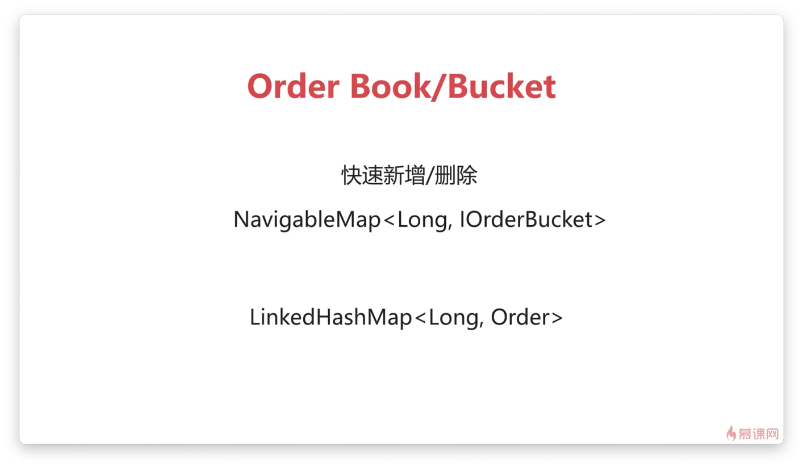

# 前置风控：
1. 实时
2. 计算逻辑不能太复杂

# 盘中、盘后风控：
1. 单独一个风控系统；
2. 非常复杂的指标计算
3. 如：持仓便利度
4. 如：曲线匹配测算、互成交等
5. 如果知道指标 和 参数，就失去意义了

# OrderCmd
通讯模版

https://www.bilibili.com/video/BV1Ew411N74t/?vd_source=4c575fa1b41c78b6f51f6c51c52d16c9
跳表为什么输：
1. 跳表的索引是随机生成的，只有刚好生成在中间时，性能才是 log(N)
    

bilibili.com/video/BV1wv411c71N?vd_source=4c575fa1b41c78b6f51f6c51c52d16c9&spm_id_from=333.788.player.player_end_recommend_autoplay

提供原始类型的特性，避免装箱拆箱，性能提供30% 