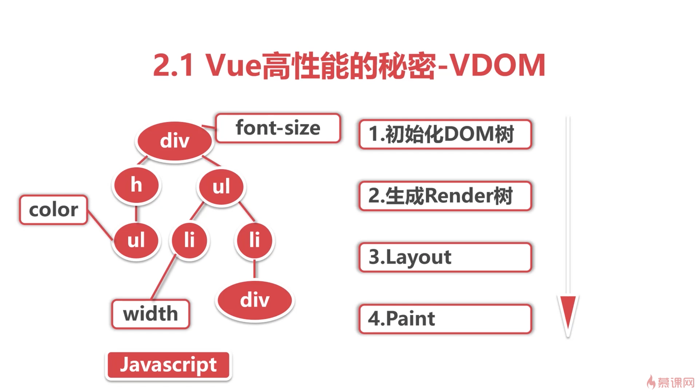
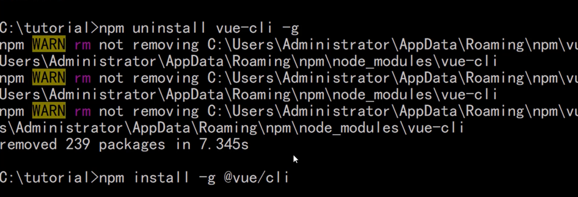

https://blog.csdn.net/chaoPerson/article/details/136121885

npm uninstall vue-cli -g
npm install -g @vue/cli
sodu npm install -g @vue/cli
vue -V
vue create cfront

cd cfront

#sudo vue add electron-builder
#sudo npm run electron:build

#sudo chmod 777 -R ./

npm run dev

npm run serve

npm install element-ui -S